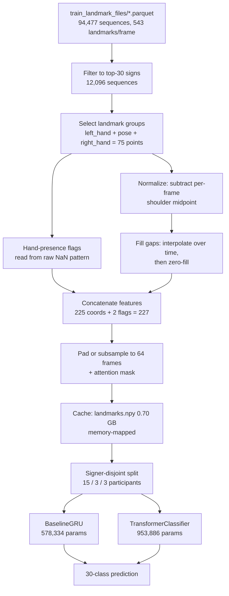
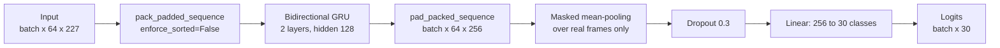
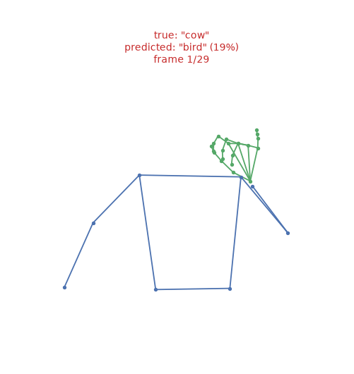
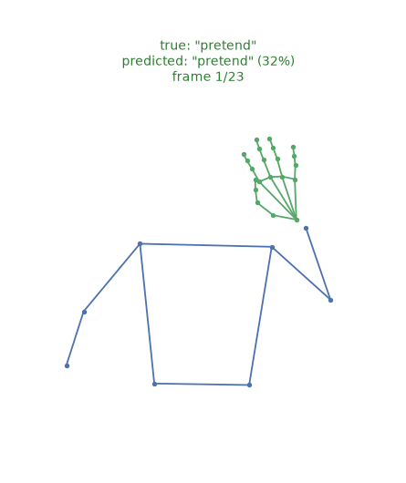
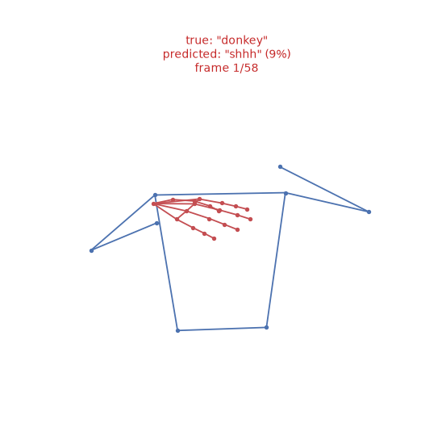

# Isolated ASL Sign Recognition from Landmark Sequences

Classification of 30 isolated American Sign Language signs from MediaPipe Holistic landmark
sequences, using the Kaggle [Google — Isolated Sign Language Recognition](https://www.kaggle.com/competitions/asl-signs)
dataset (recorded through the PopSign ASL game). The dataset ships pre-extracted landmark
coordinates rather than video, so this project starts at the landmark level: no video decoding
or pose estimation is performed. The full dataset contains 94,477 sequences across 250 signs
from 21 participants; this project uses the 30 most frequent signs (12,096 sequences, 12.8% of
the data) to keep training tractable on CPU. Two architectures — a bidirectional GRU and a
Transformer encoder — are trained under identical conditions and compared, and one feature
ablation is run. Two of the three headline results are negative or null, and are reported as
such.

---

## Pipeline



The baseline GRU in detail:



---

## Key design decisions

**Signer-disjoint splits.** Participants are partitioned before their sequences, 70/15/15 by
participant: 15 train / 3 validation / 3 test, giving 8,594 / 1,816 / 1,686 sequences. A random
split would place the same signer in both train and test, so the score would partly measure
memorisation of individuals. Every reported number is therefore accuracy on *unseen signers*.
The cost of this choice is visible in the results: test accuracy (0.5285) sits well below
validation accuracy (0.6735), because the two splits contain different people.

**`max_len = 64`.** Sequence lengths in the 30-sign subset are heavily right-skewed: median 24,
mean 39.1, p95 131, max 453. The tradeoff was measured rather than assumed:

| max_len | sequences fully covered | share of padded tensor that is real data | relative attention cost |
|--------:|------------------------:|-----------------------------------------:|------------------------:|
| 32 | 64.6% | 70.5% | 0.25x |
| **64** | **84.4%** | **47.2%** | **1.00x** |
| 96 | 90.9% | 35.6% | 2.25x |
| 128 | 94.7% | 28.5% | 4.00x |

128 buys 10.3 points more coverage but leaves 71.5% of every batch as padding and costs 4x more
attention compute. Sequences longer than `max_len` are **uniformly subsampled, not truncated**,
so a long sign keeps its ending at coarser temporal resolution instead of losing it.

**Explicit hand-presence features.** Hands leave the frame constantly — across the full subset,
36.4% of landmark coordinates were missing, and 26.4% were absent for an entire sequence (the
signature of one-handed signs, where one hand is never detected). Missing values are interpolated
over time where possible and zero-filled otherwise, but after normalization "zero" means "at the
shoulder midpoint", which is indistinguishable from a hand genuinely resting there. Two binary
flags per frame (`left_hand_present`, `right_hand_present`) are appended so absence is stated
rather than inferred, taking the feature vector from 225 to **227**. The flags are computed from
the raw NaN pattern *before* filling, and were verified to match it exactly.

**Preprocessing cache.** Decoding one parquet file — reindexing onto the full landmark grid,
interpolating, normalizing, padding — takes ~44ms. Repeated across 8,594 sequences every epoch,
that dominates training. The full subset is preprocessed once into a memory-mapped array
(12,096 x 64 x 227 float32, 0.70 GB, built in 532s at 23 sequences/s). Measured speedup:
**71x** (6.3ms vs 444.6ms per 10 items). The cache output was verified **bit-identical** to the
parquet path, which remains available behind a flag for debugging. Cache directories are named
by configuration (`left_hand+pose+right_hand_len64`), and loading hard-fails on any mismatch
between the cache and the requested feature layout.

**Packed sequences.** For a *bidirectional* RNN, masking the pooling step is not sufficient: the
backward pass would start inside the padding and carry it into the hidden states of real frames.
The GRU therefore uses `pack_padded_sequence` (with `enforce_sorted=False`, so no manual
length-sorting is needed) *and* masks the pooling. The Transformer uses `src_key_padding_mask`.
Both are verified by a test that replaces every padded position with large random values and
asserts the logits do not move — the measured change is **0.00e+00** for both models.

---

## Results

| Result | Value | Significance |
|---|---|---|
| Best model, selected on validation | **GRU** — 0.6735 val / **0.5285 test** | 16x the 3.33% chance rate |
| GRU vs Transformer | 0.5285 vs 0.5480 test | **Not significant** — McNemar p = 0.12 |
| Face landmarks added | 0.5285 → **0.4531** test (−7.5 points) | **Significant** — McNemar p = 8.75e-09 |
| Inference latency | 8.778ms → **3.223ms** (2.72x) | TorchScript + thread tuning |

### Model comparison: no measurable difference

Both models were trained through identical code, splits, cache, optimizer (AdamW, lr 1e-3,
weight decay 1e-2), batch size 32, gradient clipping 1.0, and a seeded batch order, with early
stopping on validation accuracy (patience 5, max 30 epochs).

| | BaselineGRU | TransformerClassifier |
|---|---|---|
| Parameters | 578,334 | 953,886 |
| Best val accuracy | **0.6735** (epoch 14) | 0.6514 (epoch 15) |
| Test accuracy | 0.5285 | **0.5480** |
| Test loss | 1.6945 | 1.5815 |
| Final train accuracy | 0.8458 | 0.7695 |
| Epochs / time | 19 / 1998s | 20 / 2120s |

**Neither model won.** The GRU is ahead by 2.2 points on validation; the Transformer is ahead by
2.0 points on test. The ranking flips depending on which split is consulted, which is the first
sign that the difference is not real. Three measurements confirm it:

- **McNemar's test on the test split: p = 0.1223.** The models disagree on 429 sequences — 198
  where the GRU is right and the Transformer wrong, 231 the other way. That imbalance is within
  what chance produces.
- **Per-signer accuracy varies far more than the models do.** With only 3 signers per split, the
  signer is the real unit of variation:

  | split | signer | n | GRU | Transformer | delta |
  |---|---|---:|---:|---:|---:|
  | val | 16069 | 620 | 0.6113 | 0.6129 | +0.0016 |
  | val | 22343 | 579 | 0.7150 | 0.7133 | −0.0017 |
  | val | 55372 | 617 | 0.6969 | 0.6321 | −0.0648 |
  | test | 4718 | 484 | 0.4050 | 0.5041 | +0.0992 |
  | test | 28656 | 578 | 0.6142 | 0.6540 | +0.0398 |
  | test | 36257 | 624 | 0.5449 | 0.4840 | −0.0609 |

  Per-signer accuracy spans 0.4050 to 0.7150 — a 31-point range between individuals, against a
  ~2-point range between models. Which architecture "wins" is largely determined by which
  signers landed in which split.
- **Epoch-to-epoch validation noise exceeds the gap.** Mean absolute change in validation
  accuracy between consecutive epochs was 0.0508 (GRU) and 0.0417 (Transformer), with maxima of
  0.1074 and 0.2026. The run-to-run noise is larger than the difference being measured.

The honest conclusion is that at this data scale the attention-based model is not better than the
recurrent one. This is a result, not a failure of the experiment. A plausible explanation is
that 8,594 training sequences is thin for a 954k-parameter Transformer, while recurrence supplies
a sequential inductive bias that self-attention has to learn from data; consistent with this, the
Transformer overfits less (train 0.7695 vs 0.8458) and generalises marginally better to test.
Claiming a 2-point win in either direction would not survive scrutiny.

### Face-landmark ablation: face landmarks hurt

Face is excluded by default on the reasoning that 468 of the 543 landmarks are face points that
contribute little to most isolated signs. That assumption was tested by rebuilding the cache with
face included (1,631 features vs 227) and retraining the GRU identically.

| | hands + pose | + face |
|---|---|---|
| Features per frame | 227 | 1,631 (7.2x) |
| Parameters | 578,334 | 1,656,606 |
| Best val accuracy | **0.6735** | 0.6393 |
| Test accuracy | **0.5285** | 0.4531 |
| Test loss | 1.6945 | 2.0013 |
| Macro F1 (test) | 0.524 | 0.447 |
| Epochs / time | 19 / 1998s | 27 / 3960s |

Unlike the model comparison, this effect is unambiguous:

- **Both splits move the same direction** — val −3.4 points, test −7.5 points. No flip.
- **All three test signers get worse**: −0.0579 (4718), −0.1557 (28656), −0.0144 (36257).
- **McNemar's test: p = 8.75e-09.** 306 sequences correct with hands+pose but wrong with face,
  against 179 the other way.

Adding face landmarks multiplies the input width by 7.2 and the parameter count by 2.9 without
adding any training data, so the extra dimensions act largely as noise. The cost is visible in
the training curve: the face model reached only 0.0595 validation accuracy after epoch 1
(vs 0.2307 for hands+pose) and needed 22 epochs to reach a peak the baseline hit at epoch 14.

This **confirms the original design choice with evidence rather than overturning it**. The
hands+pose default was an assumption at the start of the project and is now a measured result.

Scope of the claim: this tests face landmarks *as raw coordinates concatenated into a GRU*. Some
signs do use facial grammar, and an architecture with a dedicated face encoder or dimensionality
reduction over face points might extract signal that flat concatenation cannot.

### Inference latency

The GRU was exported to TorchScript (`script` → `freeze` → `optimize_for_inference`), with output
parity verified before saving: maximum logit difference 1.43e-06, identical predicted classes.
Benchmarked at batch size 1 over 800 runs after 100 warmup runs.

| threads | PyTorch (median) | TorchScript (median) |
|---:|---:|---:|
| 1 | 3.557ms | 3.368ms |
| **2** | 3.387ms | **3.223ms** |
| 4 | 4.152ms | 3.941ms |
| 10 (default) | 8.778ms | 7.321ms |

The export format alone accounts for only **1.20x** at the default thread count — a GRU spends
its time in already-optimised recurrent kernels that TorchScript does not replace. The larger
factor is thread count: at batch size 1 the model is far too small to occupy 10 cores, and the
cost of splitting and rejoining work at every layer exceeds the arithmetic. Combining both
gives **8.778ms → 3.223ms (2.72x), 114 → 310 sequences/s**.

These timings were taken on a working laptop, not an isolated benchmark machine. An earlier run
under ~58% background CPU load produced incoherent results (1-thread median 13.4ms) and was
discarded and re-run. Minimum times cluster at 2.6–3.2ms across all configurations, indicating
roughly 2.7ms of actual compute with the remainder being scheduling overhead.

---

## Error analysis

Test-set per-class F1 for the selected GRU ranges widely: `brown` 0.78, `uncle` 0.77, `cow` 0.75
at the top; `pretend` 0.19, `awake` 0.21, `who` 0.31 at the bottom. Overall macro F1 is 0.524.

The most frequent confusions are not random — they are signs that share hand trajectory and
differ mainly in handshape or movement direction:

| true → predicted | count |
|---|---:|
| awake → wake | 29 |
| pretend → fireman | 19 |
| wake → awake | 15 |
| pretend → donkey | 15 |
| doll → mouse | 14 |

`awake` and `wake` account for 44 errors across both directions and are closely related signs.
`pretend`, `fireman` and `donkey` all involve a hand rising to the head. With hands and pose as
the only inputs, sign pairs distinguished by fine handshape are exactly where the model fails.

`src/replay_demo.py` replays test sequences at 25/50/75/100% of their frames and records how the
prediction evolves. Across 12 randomly sampled sequences (one per distinct sign), 8 of 12 reached
their final prediction by the halfway point, and mean confidence rose 0.48 → 0.59 → 0.67 → 0.68 —
most of the certainty is established well before the sign ends.

| | |
|---|---|
|  | **`cow` — correct.** Prediction moves from `bird` at 19% on the first frame to `cow` at 99% by frame 15 and stays there. A clean case where the sign is identified early and confidence remains stable. |
|  | **`pretend` → `fireman` — incorrect.** Begins correct at 32%, then as the hand rises to the forehead the model commits to `fireman` at 94% and finishes at 99%. This is the `pretend → fireman` confusion above, visible frame by frame. |
|  | **`donkey` — correct.** Starts at `who` 28%, resolves to `donkey` at 75% by the halfway point and 96–97% thereafter. Illustrates a prediction that needs roughly half the sequence before it settles. |

Confidence is poorly calibrated on errors: `pretend → fireman` finishes at 99% confidence while
wrong. High confidence is not a usable reliability signal for this model.

---

## Methodology notes

**Model selection used validation accuracy, never test.** The GRU was chosen because it scored
higher on validation (0.6735 vs 0.6514), even though the Transformer scored higher on test.
Selecting on test would leak the held-out split into the choice and inflate the headline number.
An earlier version of `src/evaluate.py` selected the reported model by test accuracy; this was a
bug and was fixed — selection is now explicitly on validation, and test is read once, for
reporting, after the choice is made.

**Differences were tested, not eyeballed.** A 2-point accuracy gap on 1,686 samples is easy to
present as an improvement. McNemar's test on paired predictions gives p = 0.1223 for GRU vs
Transformer (not significant) and p = 8.75e-09 for the face ablation (significant). The two
comparisons look superficially similar in size but are statistically very different, and only
the test distinguishes them.

**Per-signer variance was checked because n = 3.** With three signers per split, aggregate
accuracy has an effective sample size closer to 3 than to 1,686. Per-signer accuracy spans 31
points, so any model difference smaller than that should be treated as unresolved. This is also
why the validation/test ranking flip is expected rather than surprising.

**The ablation confirmed the original design rather than overturning it.** Excluding face
landmarks began as an assumption; the ablation makes it a measured result with p = 8.75e-09. A
confirmed hypothesis is a real finding — the alternative would have been to leave the default
untested.

**Reproducibility.** Seeds are set for Python, NumPy and torch before each model is constructed,
and the training DataLoader uses a seeded generator, so both models see identical batch order.
Re-running training reproduced epoch-1 metrics exactly (train loss 2.9181, val accuracy 0.2307).

---

## Limitations

- **30 of 250 signs.** The vocabulary is the 30 most frequent signs, 12.8% of the dataset.
  Accuracy would be substantially lower across the full 250-sign space, and these results do not
  extrapolate to it.
- **21 participants total, 3 per evaluation split.** This is the binding constraint on every
  conclusion here. It is why the model comparison is unresolved, and why all reported accuracies
  carry wide uncertainty. More signers would matter more than more sequences.
- **CPU-only training.** No GPU was available, so model sizes and epoch budgets were chosen
  accordingly (~105s/epoch, 30 epochs maximum, patience 5). Both models were still improving on
  train accuracy when early stopping fired, so neither is trained to convergence. The Transformer
  in particular was given no learning-rate warmup, which it would normally benefit from — with a
  longer schedule the comparison could plausibly change.
- **The replay demo is not causal streaming.** The GRU is bidirectional, so each partial-sequence
  prediction re-runs the model over a growing prefix rather than updating a running state. The
  numbers are valid (each prediction sees only frames up to that point) but they are not a
  real-time latency claim. True online decoding would require a unidirectional model.
- **Frames are cached frames, not video frames.** Sequences longer than 64 frames were uniformly
  subsampled during preprocessing, so "50% of frames" refers to the normalized representation.
- **No hyperparameter search.** Defaults were chosen once and applied identically to both models
  for fairness. Neither is tuned.

---

## Setup and reproduction

Requires Python 3.10+. Disk: the extracted dataset is 53 GB, but the download peaks at roughly
90 GB because the 37.4 GB archive is deleted only after extraction completes. Add 0.70 GB for the
default cache, or 5.05 GB for the face-inclusive one.

### 1. Environment

```bash
python -m venv .venv
# Windows
.venv\Scripts\activate
# macOS / Linux
source .venv/bin/activate

pip install -r requirements.txt
```

### 2. Kaggle credentials

Accept the [competition rules](https://www.kaggle.com/competitions/asl-signs/rules) first, or
downloads return 403. Then authenticate either way:

```bash
kaggle auth login          # OAuth, what the current CLI recommends
```

or place an API token file (Settings → API → "Create New Token") at
`~/.kaggle/kaggle.json`, or `C:\Users\<you>\.kaggle\kaggle.json` on Windows. On macOS/Linux run
`chmod 600 ~/.kaggle/kaggle.json`. Verified against `kaggle` 2.2.4, which still reads this file.

### 3. Run the pipeline in order

```bash
# Download and unzip (~37.4 GB, roughly an hour on a 12 MB/s connection)
python src/download_data.py

# Confirm the data looks as expected
python src/inspect_data.py

# Preprocess into the memory-mapped cache (~9 minutes)
python -m src.preprocess_cache

# Verify the Dataset and both models before training
python -m src.test_dataset
python -m src.test_models

# Train both models (~35 minutes each on CPU)
python -m src.train

# Test-set metrics, per-class report, confusion matrix
python -m src.evaluate

# Replay demo and animations
python -m src.replay_demo --num-sequences 12 --animate 3

# TorchScript export and latency benchmark
python -m src.export_model
```

Face ablation (optional, ~15 minutes to cache and ~65 minutes to train):

```bash
python -m src.preprocess_cache --landmark-types face left_hand pose right_hand
python -m src.train --models gru --landmark-types face left_hand pose right_hand --tag _face
python -m src.evaluate --models gru --landmark-types face left_hand pose right_hand --tag _face
```

Exploratory analysis, including the sequence-length distribution and skeleton visualisations,
is in `notebooks/eda.ipynb`. It runs whether the kernel starts in `notebooks/` or at the project
root.

### Repository layout

```
src/
  dataset.py                 Dataset, signer-disjoint splits, normalization, caching
  preprocess_cache.py        Builds the memory-mapped cache
  models/
    baseline_gru.py          Packed bidirectional GRU + masked pooling
    transformer_classifier.py  Transformer encoder + learned positions + attention pooling
  train_utils.py             Shared train/eval loops, config, early stopping
  train.py                   Trains both models identically
  evaluate.py                Test metrics, per-class report, confusion matrix
  replay_demo.py             Progressive-prefix inference and animations
  export_model.py            TorchScript export and latency benchmark
  test_dataset.py            Dataset smoke test
  test_models.py             Model smoke test, including the padding-leak assertion
notebooks/eda.ipynb          Exploratory data analysis
reports/figures/             Training curves, confusion matrices, replay GIFs
data/, models/               Gitignored
```

### Vocabulary

The 30 signs, selected by frequency and sorted alphabetically:

`awake, bird, brown, bye, cat, cow, doll, donkey, drink, duck, fireman, first, hear, icecream,
lips, listen, look, make, mouse, napkin, nuts, pen, pretend, shhh, sleepy, think, toothbrush,
uncle, wake, who`
